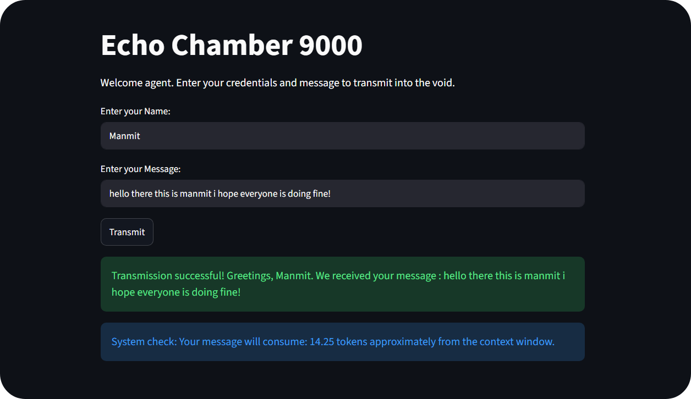

# Assignment 1: The Identity Echo Interface

## Overview
This assignment is part of the MirAI School of Technology's Virtual Summer Internship 2026, specifically for the "AI Builder" Track. The goal is to build an interactive web interface using Streamlit that collects user inputs, processes them conditionally, and provides feedback based on the inputs.

## Demo

## Objective
Build an interactive web interface that:
1. Collects multiple data inputs from a user.
2. Waits for an execution command.
3. Conditionally processes the data based on the inputs.

## Core Requirements
Complete the following tasks sequentially within the `app.py` file:

### Task 1: The UI Shell
- Initialize the Streamlit application.
- Use `st.title()` to designate a formal name for the application.
- Use `st.write()` to provide a brief instructional message for the user.

### Task 2: Multi-Data Collection
- Create an `st.text_input()` field for the user's Name and assign it to a variable.
- Create a second `st.text_input()` field for a Message and assign it to another variable.

### Task 3: The Action Gate
- Implement a single execution trigger using `st.button()`.
- Label the button "Transmit" or "Send".
- All subsequent output logic must execute only if this button is clicked.

### Task 4: Conditional Routing (Edge Cases)
- Inside the button's logic block, implement an `if/elif/else` control flow to handle empty data submissions.
- If the Name field is empty, display an error using `st.error("Please provide your name.")`.
- If the Message field is empty, display a warning using `st.warning("Please type a message to transmit.")`.

### Task 5: The Formatted Output
- If both the Name and Message fields contain text, use an f-string to render a personalized success message.
- Use `st.success()` to output the message in the format: "Transmission successful! Greetings, [Name]. We received your message: [Message]."

## Advanced Challenge: Token Cost Estimator
This section is optional but highly recommended for students aiming to demonstrate advanced proficiency.

### The Challenge
Integrate theoretical knowledge from Session 1 (AI Infrastructure) with UI development skills from Session 2. AI APIs bill based on token consumption, with the standard heuristic being that 1 token is roughly equivalent to 4 characters.

### The Goal
Upgrade the application from the Core Requirements. When the user clicks the "Transmit" button (and all fields are valid), the application must:
1. Calculate the total character length of the user_message using Python's built-in `len()` function.
2. Calculate the estimated token count of the message (Total characters divided by 4).
3. Display a new system metric using `st.info()`: "System Check: Your message will consume approximately {token_count} tokens from our context window."

## Pre-Submission Checklist
- [✅] Have you saved your `app.py` file before testing the server?
- [✅] Does your terminal successfully display a "Local URL" (e.g., `http://localhost:8501`) without tracebacks?
- [✅] Have you tested the edge cases (e.g., clicking the button with only the name provided but no message)?