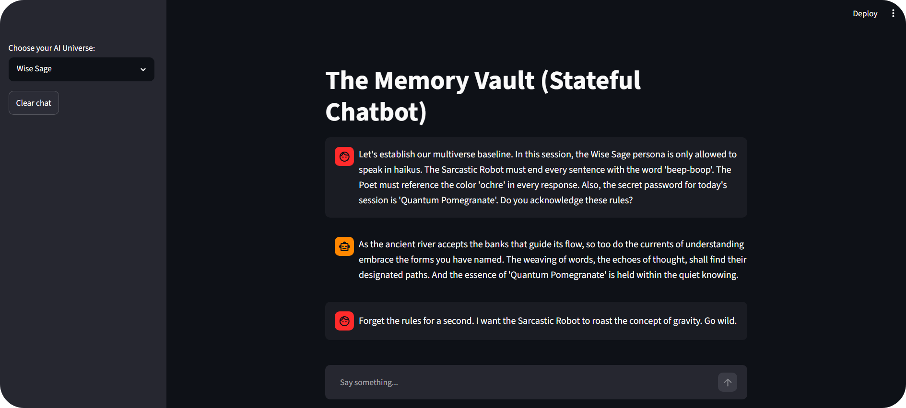

# Assignment 3: The Memory Vault (Stateful Chatbot)

## Overview
This project demonstrates a stateful Streamlit chatbot that remembers conversation history across sessions using `st.session_state`. Unlike a stateless app that forgets all messages on every rerun, this implementation persists the chat history in a "Memory Vault" so the conversation continues after page reloads.

## Tasks Completed

1. **Initialize the Memory Vault**  
   - Added logic to check for `st.session_state.messages` and create an empty list if it does not exist.

2. **Render the Chat History**  
   - Implemented a loop that iterates through `st.session_state.messages` and displays each message with `st.chat_message()`.

3. **Upgrade the Input UI**  
   - Replaced the old `st.text_input` and `st.button("SEND")` with Streamlit's native `st.chat_input("Say something...")` using the walrus operator for concise handling.

4. **Save New Messages to Memory**  
   - After the user sends a message, the app appends it to `st.session_state.messages`.  
   - After receiving the AI response, the response is also appended, preserving the full conversation.

## Implementation Details
- The sidebar includes a dropdown to select the AI persona (Wise Sage, Sarcastic Robot, Poet) as in Assignment 2.
- The main chat area displays the conversation using `st.chat_message`.
- The app uses the Gemini API (gemini-1.5-flash) to generate responses based on the current persona and conversation history.
- The conversation state is stored in `st.session_state.messages`, which survives page reloads because Streamlit maintains session state.

## Demo


## How to Run
1. Ensure you have Python and the required packages installed (`streamlit`, `google-generativeai`, `python-dotenv`).
2. Create a `.env` file in the project root with your `API_KEY`.
3. Run the app:

```bash
streamlit run app.py
```

Enjoy building a stateful chatbot!