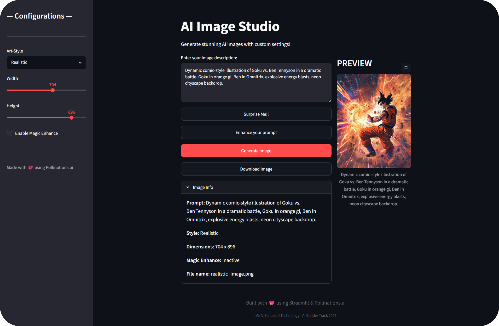

# AI Image Studio

An upgraded AI-powered image generation app built with **Streamlit** and **Pollinations.ai**, designed to turn a working prototype into a polished, user-friendly mini SaaS product.

## Demo 
### Video Link to demo video: [AI Image Studio Demo](https://drive.google.com/file/d/1j-mNqo82AMvEcW0PUfoZvu0ZInFSO5eM/view?usp=sharing)



## Overview

**Course:** MirAI School of Technology — AI Builder Track 2026  
**Assignment:** Assignment 4  

### Objective

Transform a working prototype into a polished product by:

- Debugging existing issues
- Improving usability
- Adding UX-focused features
- Making the application more production-ready

## Features

### Core Improvements

- Custom image dimensions with working width and height sliders
- Proper image download support with `.png` file extension
- Magic Enhance toggle for higher-quality prompt output
- Surprise Me feature for instant prompt inspiration

### Advanced Features

- AI-powered prompt enhancement using Groq API
- Persistent session state management
- Professional image preview and download flow
- Better error handling and user feedback
- Image metadata display after generation

## Completed Requirements

### 1. Fixed Broken Sliders

**Problem:** Width and height sliders were visible in the UI but not passed to the Pollinations API.

**Solution:**

- Added width and height query parameters to the API request
- Ensured prompt, width, and height are all included correctly

```python
?width={width}&height={height}
```

**Result:** Generated images now respect the selected dimensions.

### 2. Fixed File Extension

**Problem:** Downloaded images did not include a valid file extension.

**Solution:**

- Added the `.png` extension
- Used dynamic file naming based on style

```python
f"{art_style}_image.png"
```

**Result:** Downloaded files open correctly as images.

### 3. Added Magic Enhance

**Problem:** Users may struggle to write strong prompts for image generation.

**Solution:**

- Added a sidebar checkbox called **Enable Magic Enhance**
- Appended quality-focused keywords to the prompt when enabled

**Enhancement string:**

```text
masterpiece, 8k resolution, highly detailed, trending on artstation, unreal engine 5 render
```

**Result:** Improved image quality with minimal user effort.

### 4. Added Surprise Me

**Problem:** Users may experience prompt writer’s block.

**Solution:**

- Added a random prompt generator
- Used `random.choice()` to select from preset creative prompts
- Enabled one-click prompt inspiration and generation

**Result:** Faster engagement and a smoother creative experience.

## Full Feature List

- **Custom Dimensions:** Width and height sliders from 256 to 1024 px
- **Art Style Selection:** Realistic, Anime, CyberPunk, Fantasy, Watercolor
- **Magic Enhance:** Optional quality boost for generated prompts
- **Surprise Me:** Random creative prompt generation
- **Prompt Enhancement:** AI-based prompt rewriting using Groq
- **Image Download:** Proper PNG download with dynamic filenames
- **Image Info Panel:** Prompt, style, dimensions, and enhancement metadata
- **Persistent Preview:** Generated image remains visible across reruns

## Tech Stack

| Layer | Technology |
|---|---|
| Frontend | Streamlit |
| Language | Python 3.9+ |
| Image API | Pollinations.ai |
| Prompt Enhancement | Groq API |
| HTTP Client | `requests` |
| Image Handling | `Pillow` |
| Environment Config | `python-dotenv` |
| API Client | `openai` |

## Project Structure

```text
ai-image-studio/
│
├── app.py
├── .env
├── README.md
└── demo/
    └── demo.png
```

## Setup

### Prerequisites

- Python 3.9 or higher
- `pip`
- Optional: Groq API key for prompt enhancement

### Installation

```bash
git clone https://github.com/your-repo/ai-image-studio.git
cd ai-image-studio
pip install streamlit requests pillow python-dotenv openai
```

### Environment Variables

Create a `.env` file in the project root:

```env
GROQ_API_KEY=your_groq_api_key_here
```

### Run the App

```bash
streamlit run app.py
```

## Usage

1. Enter an image prompt.
2. Choose an art style.
3. Adjust width and height.
4. Optionally enable **Magic Enhance**.
5. Optionally click **Surprise Me** for a random prompt.
6. Click **Generate Image**.
7. Preview the result and download it as a PNG.


## Pre-Submission Checklist

### Functionality

- [✅] Width and height sliders affect generated image dimensions
- [✅] Downloaded files open correctly as images
- [✅] Surprise Me generates random prompts successfully
- [✅] Magic Enhance improves prompt quality
- [✅] All features work without crashes

### Code Quality

- [✅] Clean and modular structure
- [✅] Proper error handling
- [✅] Meaningful variable and function names
- [✅] No deprecated or unused code
- [✅] Good separation of responsibilities

### Documentation

- [✅] README is clear and up to date
- [✅] Setup steps are easy to follow
- [✅] Features are documented
- [✅] Demo image is included

## Engineering Highlights

### Session State Management

- Centralized initialization at app startup
- Safe updates through callback-style logic
- Prevents common Streamlit session-state errors

### Error Handling

- Handles missing API keys gracefully
- Shows user-friendly feedback for request failures
- Prevents broken UI flows during generation or enhancement

### Code Organization

- Modular helper functions
- Clear naming conventions
- Easier debugging and future expansion

### User Experience

- Clean sidebar-based configuration
- Persistent preview and metadata display
- One-click download flow
- Reduced friction for first-time users

## Learning Outcomes

This project helped strengthen:

1. Debugging real application issues
2. Building features on top of an existing prototype
3. Working with external APIs
4. Managing Streamlit session state correctly
5. Improving application polish and usability

## Acknowledgments

**Built with:** Streamlit and Pollinations.ai  
**Course:** MirAI School of Technology — AI Builder Track 2026  
**Instructor:** Your Instructor's Name  
**Student:** Your Name  

Special thanks to the MirAI School of Technology team for their guidance and support throughout the project.

## Future Enhancements

Potential next steps for the project:

- User accounts and saved preferences
- Image history and gallery view
- More advanced generation controls
- Social sharing options
- Better mobile responsiveness
- Prompt history and reuse
- Multi-image generation modes